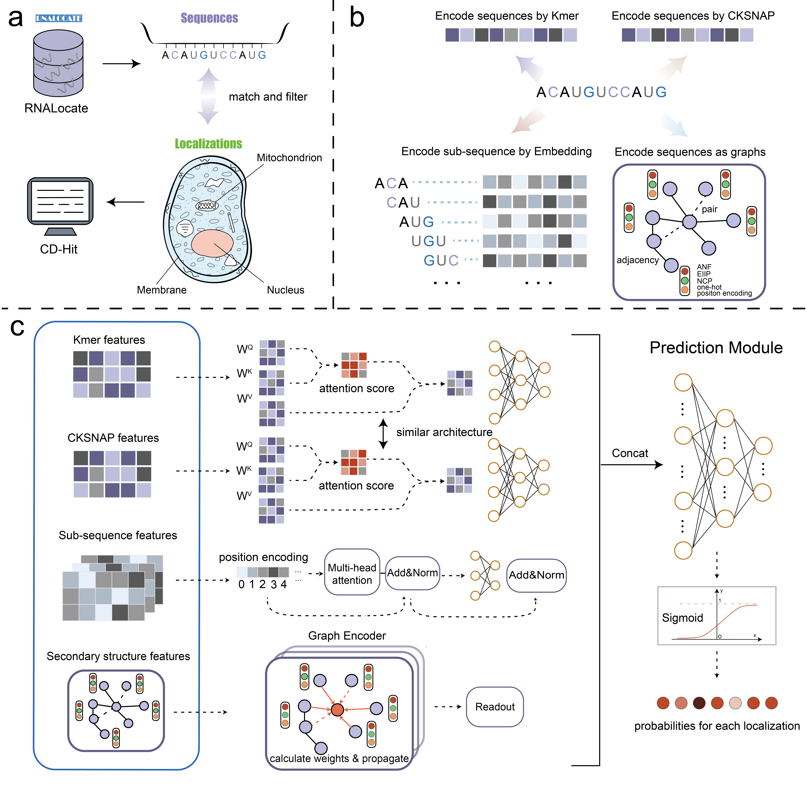

# LncTracker: a unified multi-channel framework for multi-label lncRNA localization
## Introduction

Long non-coding RNAs (lncRNAs) play essential roles in various biological processes, including chromatin modification, cell cycle regulation, transcription, and translation. Recent studies have revealed that the biological functions of lncRNAs are closely associated with their subcellular localizations, making accurate localization prediction critical for understanding their biological roles in cellular regulation and disease mechanisms. However, most existing methods mainly rely on sequence features while neglecting structural information, and they often limited to single-label predictions covering only a small number of subcellular compartments. In this study, we proposed an efficient deep learning framework, LncTracker, for multi-label prediction of lncRNA subcellular localizations across seven distinct compartments. LncTracker adopts a multi-channel architecture that integrates diverse input features into model training, including both primary sequence and secondary structure information. Secondary structures are converted into attributed graphs to capture spatial relationships among nucleotides, including adjacency and base-pairing connections. These structural features are then combined with sequence-based features to predict subcellular localization probabilities. Such a design enables LncTracker to learn joint representations of sequences and structures, thereby enhancing predictive performance and robustness. Benchmarking experiments demonstrated the superiority of LncTracker over state-of-the-art approaches, particularly in handling imbalanced localization scenarios. 



### Quick Start

Clone the repository:
```bash
git clone https://github.com/ABILiLab/LncTracker.git
cd LncTracker
```

### Environment Setup

To reproduce the environment, run the following command:

```bash
conda env create -f environment.yml
conda activate lnctracker
```

### Training
To train the model, run the following command in the background. It will save the training logs to train.log.

```python
nohup python -u run_train.py \
  --input_path ./data/lnctracker_6000.fasta \
  --batch_size 32 \
  --learningrate 0.0001 \
  --epochs 200 \
  --patience 30 \
  --isMultiLabel True \
  --isAutoThres False \
  --device cuda \
  > train.log 2>&1 &
```

You can retrain the model using your own RNA dataset by replacing the --input_path argument with the path to your custom FASTA file. The format should be:

<pre> >seq1|nucleus,cytoplasm 
AUGCUAGCUAGCUGA...  </pre>

#### Training Parameters

- `--input_path`: Path to the training FASTA file (e.g., `lnctracker.fasta`).
- `--batch_size`: Number of samples per batch.
- `--learningrate`: Learning rate for optimizer.
- `--epochs`: Maximum number of training epochs.
- `--patience`: Early stopping patience.
- `--isMultiLabel`: Whether it’s a multi-label classification task.
- `--isAutoThres`: Whether to use automatic threshold selection.
- `--device`: Computation device ('cpu' or 'cuda').

### Prediction
You can use the following command to perform prediction on your sequences using the pretrained model:

```python
nohup python -u run_predict.py \
  --input_path ./data/example.fasta \
  --output_path ./results/predict_result.csv \
  --batch_size 32 \
  --isMultiLabel True \
  --isAutoThres True \
  --device cuda \
  > test.log 2>&1 &
```

#### Prediction Parameters

- `--input_path`: Path to the input FASTA file for prediction.
- `--output_path`: File path to save the prediction results.
- `--batch_size`: Batch size for prediction (default: 32).
- `--isMultiLabel`: Whether it’s a multi-label classification task.
- `--isAutoThres`: Whether to use automatic threshold selection.
- `--device`: Computation device ('cpu' or 'cuda').
